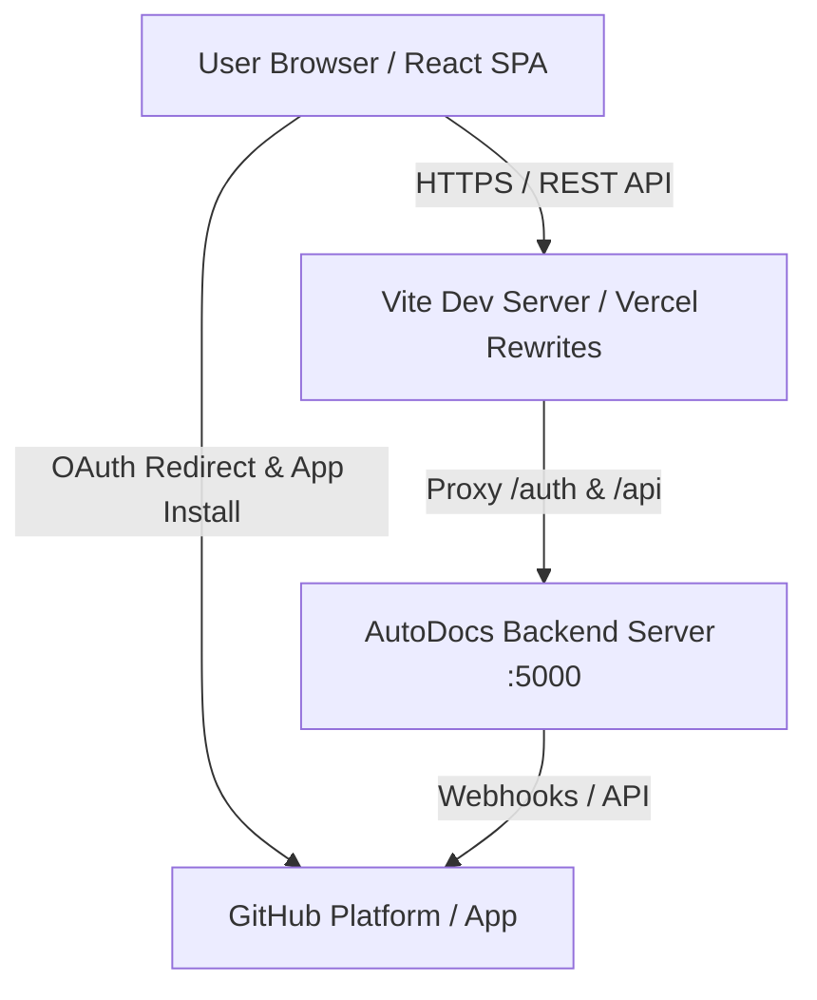
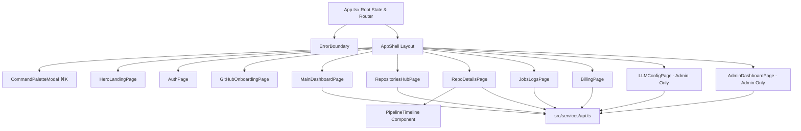
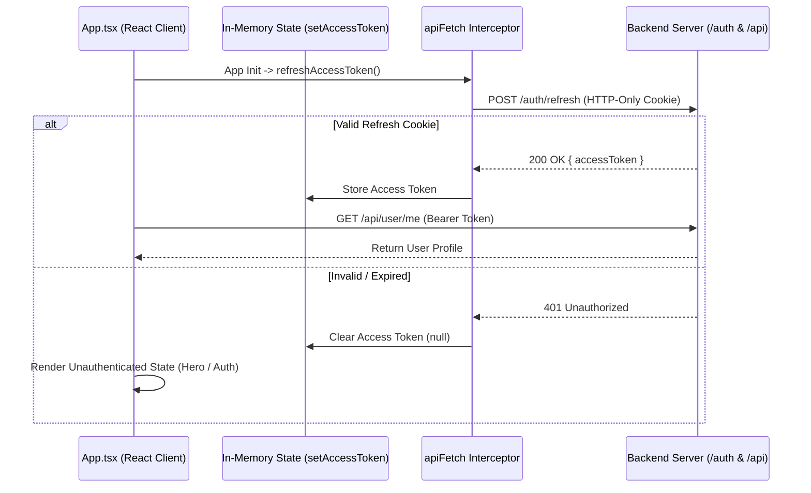

# System Architecture — AutoDocs Client (`autodocs-client`)

## Overview
AutoDocs Client is a Single Page Application (SPA) built with React 18, TypeScript, and Vite. It serves as the developer dashboard and management console for the AutoDocs engine—an autonomous, commit-driven documentation synchronization platform. The application provides repository management, real-time documentation generation monitoring, execution log inspection, billing and credit ledger tracking, and superadmin controls for multi-model LLM task pipeline configurations.

---

## 1. Architectural Patterns, Approach & Core Technology

### Primary Architectural Style
* **Single Page Application (SPA):** Pure client-side rendered application utilizing React 18 and Vite.
* **State-Driven Routing:** Screen navigation is managed through explicit top-level state (`ActiveScreen`) combined with browser history replacement for OAuth callbacks, avoiding external browser router complexity.
* **Service-Centric API Layer:** All backend API communication is abstracted through a centralized service module (`src/services/api.ts`) using a custom HTTP wrapper (`apiFetch`) with built-in token management and silent refresh interception.

### Tech Stack & Libraries
* **UI Runtime:** React 18.3 (`react`, `react-dom`)
* **Build Tool & Bundler:** Vite 6.1 with `@vitejs/plugin-react` and TypeScript 5.7
* **Iconography:** Lucide React (`lucide-react`)
* **Markdown Rendering:** `react-markdown` for rendering `ARCHITECTURE.md` previews
* **Styling System:** CSS Custom Properties with glassmorphism UI patterns (`src/index.css`)



---

## 2. Data Models & State Architecture

The application maintains clean domain models defined in `src/types.ts` and managed in memory during runtime.

### Core Entities
* **User (`User`):** Represents authenticated developers or administrators. Stores profile information, subscription plan (`FREE`, `PRO`, `ENTERPRISE`), user role (`USER`, `ADMIN`), credit balance, and GitHub installation ID.
* **Accessible Repository (`AccessibleRepo`):** GitHub repositories accessible to the user via the installed AutoDocs GitHub App.
* **Imported Repository (`ImportedRepo`):** Repositories actively linked to AutoDocs for automated documentation scanning and pull request generation.
* **Documentation Job (`DocJob`):** Execution runs triggered by `git push` webhooks or manual requests. Contains commit SHA, job status, credits consumed, model used, latency, token breakdown, and stdout logs.
* **Billing & Ledger (`BillingSummary`, `LedgerTransaction`, `CreditRequest`):** Immutable transaction ledger records and manual credit grant application state.
* **LLM Pipeline Configuration (`TaskConfig`, `ModelRosterItem`, `PromptTemplate`):** Admin configurations binding task keys (`tinyRepo`, `judge`, `docsGenerator`, `moduleSummary`) to specific LLM models (Google Gemini, OpenAI, Anthropic) and prompt templates.

### State & Token Persistence
* **Access Token:** Maintained purely in memory (`currentAccessToken` in `src/services/api.ts`) to mitigate XSS exposure.
* **Refresh Session:** Persistent HTTP-only cookies managed by the backend server, accessed via `credentials: 'include'` on authentication requests.

---

## 3. API Surface & Interface Layer

The client communicates with a Node.js backend (running on port 5000 by default) through standardized REST endpoints:

### Authentication Routes (`/auth/*`)
* `POST /auth/refresh`: Silently rotates refresh tokens and returns a short-lived Bearer access token.
* `POST /auth/logout`: Revokes active user session cookies.
* `GET /auth/github`: Initiates GitHub OAuth authentication flow.

### Core Application APIs (`/api/*`)
* `GET /api/user/me`: Retrieves current authenticated user profile and credit quota.
* `GET /api/github/installation-status`: Verifies GitHub App installation state.
* `GET /api/github/accessible-repos`: Lists GitHub repos available for import.
* `GET /api/github/imported-repos`: Lists actively connected repositories.
* `POST /api/github/import-repo`: Connects a repository and initializes codebase diff scanning.
* `DELETE /api/github/repo/:id`: Unlinks an imported repository.
* `GET /api/repos/:id`: Fetches repository telemetry and job history.
* `POST /api/repos/:id/trigger`: Manually triggers documentation generation.
* `GET /api/repos/:id/docs`: Retrieves generated `ARCHITECTURE.md` content.
* `GET /api/jobs` & `GET /api/jobs/stats`: Retrieves job execution logs and aggregated metrics.
* `POST /api/jobs/:id/retry`: Re-queues a failed or dropped documentation job.
* `GET /api/billing/summary` & `POST /api/billing/request`: Fetches credit ledger and submits grant applications.
* `GET /api/search?q=...`: Global command palette search endpoint (`⌘K`).

### Superadmin APIs (`/api/admin/*`, `/api/llm-config/*`, `/api/models/*`, `/api/prompts/*`)
* `GET /api/admin/stats` & `GET /api/admin/users`: Monitors system users, LLM spend, and BullMQ queue health (`repo-storage-queue`, `push-classify-queue`, `doc-generation-queue`).
* `POST /api/admin/users/:id/promote`: Promotes standard users to `ADMIN` role.
* `GET|POST|PUT|DELETE /api/llm-config`: Manages task-to-model bindings.
* `GET|POST|DELETE /api/models`: Manages registered LLM provider models.
* `GET|POST|PUT|DELETE /api/prompts`: Manages system prompt template library.

---

## 4. Directory Structure & Module Boundaries

```
src/
├── components/               # Reusable UI & Layout Components
│   ├── AppShell.tsx          # Main application layout, sidebar, sticky header, & credit pill
│   ├── CommandPaletteModal.tsx# Global ⌘K search modal interacting with /api/search
│   ├── ErrorBoundary.tsx     # React Error Boundary for uncaught rendering errors
│   └── PipelineTimeline.tsx  # Visual timeline stepper for multi-stage doc pipelines
├── pages/                    # Screen-level view components
│   ├── AdminDashboardPage.tsx# Admin master console for telemetry & user management
│   ├── AuthPage.tsx          # GitHub OAuth & Instant Demo developer login
│   ├── BillingPage.tsx       # Credit ledger, usage graph, & grant request form
│   ├── GitHubOnboardingPage.tsx# 3-step GitHub App installation wizard
│   ├── HeroLandingPage.tsx   # Public marketing & feature overview page
│   ├── JobsLogsPage.tsx      # Job execution logs, time-series chart, & retry controls
│   ├── LLMConfigPage.tsx     # LLM provider roster, task bindings, & prompt editor
│   ├── MainDashboardPage.tsx # Core developer dashboard & 7-day sparkline
│   ├── RepoDetailsPage.tsx   # Repository doc viewer (ARCHITECTURE.md) & run history
│   └── RepositoriesHubPage.tsx# Repository import & hub management
├── services/
│   └── api.ts                # Centralized API service layer with auto-token refresh
├── App.tsx                   # Main React entrypoint, state router, & auth initialization
├── main.tsx                  # React DOM root mounting point
├── types.ts                  # TypeScript interfaces & domain entity declarations
└── index.css                 # Glassmorphic CSS variables, utility classes, & reset
```

---

## 5. Navigation & Screen Flow



---

## 6. Security, Trust Boundaries & Role Controls

### Authentication Interceptor (`apiFetch`)
When an API call returns HTTP `401 Unauthorized`, `apiFetch` automatically calls `refreshAccessToken()`. If token rotation succeeds, the pending request is retried with the new Bearer token seamlessly.



### Role-Based Access Control (RBAC)
* **USER:** Access restricted to core screens (`dashboard`, `repos`, `repo-details`, `jobs`, `billing`).
* **ADMIN:** Granted access to `llm-config` and `admin` master console screens. Non-admin navigation attempts to restricted screens trigger explicit Access Denied guards or fallback redirects.

---

## 7. Configuration & Environment Requirements

### Environment Variables
The application resolves its backend API target URL using the following priority order:
1. `import.meta.env.VITE_BACKEND_URL` / `import.meta.env.VITE_BACKED_URL`
2. `process.env.VITE_BACKEND_URL` / `process.env.BACKEND_URL`
3. Fallback: Relative URL `""` in browser environments or `http://localhost:5000` in non-browser Node environments.

### Development Proxy (`vite.config.ts`)
During development, Vite forwards API requests to port `5000`:
```typescript // vite.config.ts
server: {
  port: 5173,
  proxy: {
    '/auth': { target: 'http://localhost:5000', changeOrigin: true, secure: false },
    '/api':  { target: 'http://localhost:5000', changeOrigin: true, secure: false }
  }
}
```

### Production Build & Deployment
* **Build Command:** `npm run build` (`tsc && vite build`)
* **Deployment Target:** Compatible with Vercel or any static host. Included `vercel.json` provides SPA route rewriting (`/(.*) -> /index.html`).